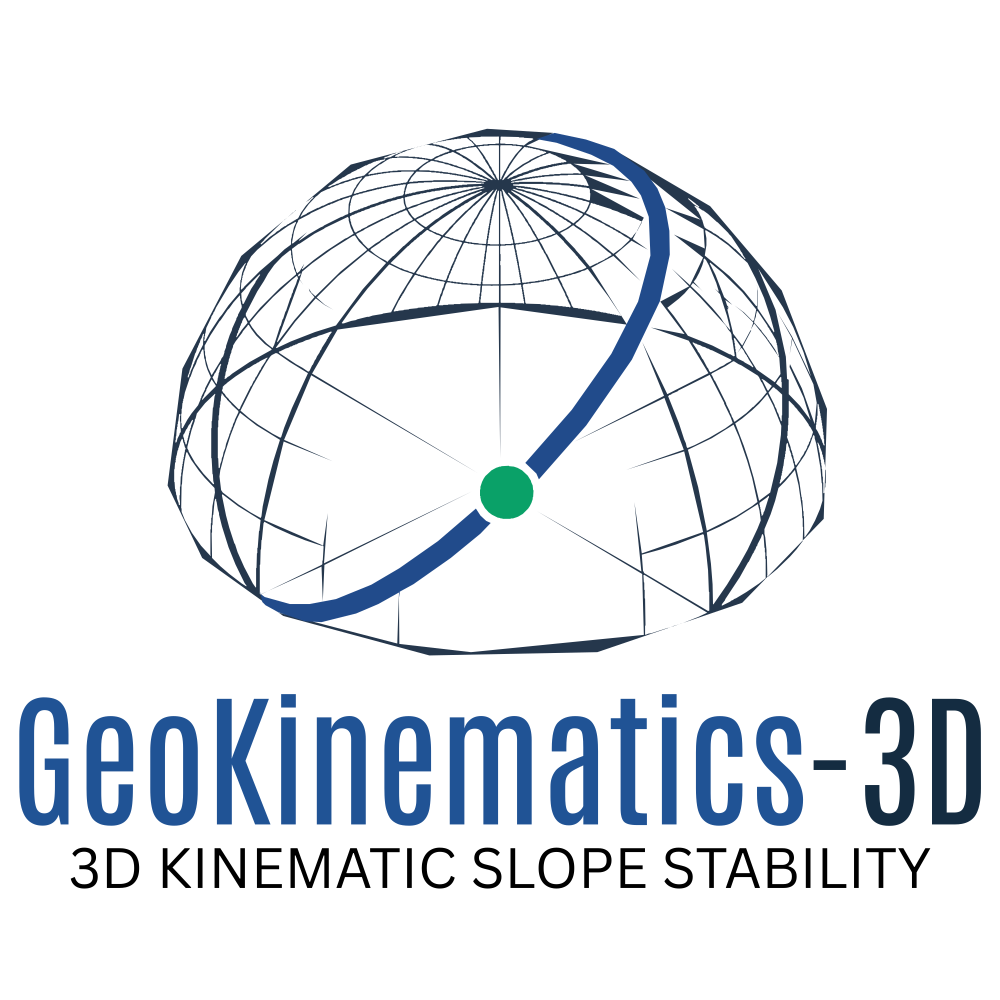

<div align="center">
  <picture>
    <source
      media="(prefers-color-scheme: dark)"
      srcset="docs/assets/logo/GeoKinematics-3D-vector-dark.svg"
    />
    <source
      media="(prefers-color-scheme: light)"
      srcset="docs/assets/logo/GeoKinematics-3D-vector.svg"
    />
    
  </picture>
</div>

# GeoKinematics-3D

[](https://github.com/nabielnovelkhubran/GeoKinematics-3D/actions/workflows/ci.yml)
[](https://opensource.org/licenses/Apache-2.0)
[](#roadmap)
[](https://www.repo-grade.com/report/nabielnovelkhubran/geokinematics-3d)

Browser-based software for rock-slope kinematic analysis, combining geological geometry, stereonet mathematics, 3D visualization, and Rust/WASM computation.

> **Status:** Phase 1 complete · Phase 2A.2 complete

## Current state

The project builds geometry from the coordinate conventions upward. Each layer is tested before the next is built on top of it.

Implemented:

- East-North-Up (ENU) coordinate convention with deterministic normal canonicalization
- Geological line and plane orientations (trend/plunge, dip direction/dip)
- 3D vector operations, plane geometry, and plane intersection
- Wulff lower-hemisphere equal-angle stereonet projection
- Lineation projection, plane-pole projection, great-circle generation
- Small-circle projection geometry and downward direction canonicalization
- Slope face, friction angle, and kinematic angular tolerance domain types
- Kinematic admissibility evaluators: planar sliding, wedge sliding, direct toppling
- Rust/WASM computation boundary
- Interactive SVG stereonet with cursor tracking, feature selection, and workspace inspector
- 212+ unit tests across 4 packages, Playwright E2E tests, Rust tests
- CI pipeline: format, lint, typecheck, test, build, E2E, Rust checks

The kinematic evaluators are pure deterministic functions with no React, DOM, or browser dependencies. They live in `packages/kinematics` and are independently testable.

Slope configuration UI and stereonet overlay of kinematic envelopes are not implemented yet.

## Roadmap

| Phase | Description                         | Status   |
| ----- | ----------------------------------- | -------- |
| 0.1   | Repository architecture and tooling | Complete |
| 1A    | Coordinate and orientation contract | Complete |
| 1B    | Vector and plane mathematics        | Complete |
| 1C    | Stereonet mathematics               | Complete |
| 1D    | Stereonet visualization             | Complete |
| 2A.1  | Domain & geometry envelopes         | Complete |
| 2A.2  | Kinematic admissibility evaluators  | Complete |
| 2A.3+ | Kinematic visualization & UI        | Planned  |
| 3     | Interactive 3D geological workspace | Planned  |
| 4     | Limit-equilibrium analysis          | Planned  |

---

## Scientific conventions

### Coordinate system

GeoKinematics-3D uses a right-handed East-North-Up coordinate system:

```text
+X = East
+Y = North
+Z = Up
```

Azimuths are measured clockwise from North.

### Geological orientations

Line orientations use:

```text
trend + plunge
```

Plane orientations use:

```text
dip direction + dip
```

Angles are represented explicitly as degrees or radians depending on the API.

### Numerical tolerance

Core geometric operations use:

```text
CANONICAL_EPSILON = 1e-12
```

This is used for operations such as zero-vector detection, normal canonicalization, parallelism, orthogonality, and floating-point boundary checks.

---

## Stereonet mathematics

Phase 1C implements a lower-hemisphere equal-angle stereographic projection (Wulff net).

The geometry package currently provides:

- Line orientation normalization
- Line orientation ↔ Cartesian vector conversion
- Wulff projection
- Wulff inverse projection
- Plane-pole projection
- Plane great-circle generation

Projected points use normalized stereonet coordinates:

```text
x ∈ [-1, 1]
y ∈ [-1, 1]
```

The UI layer maps these normalized coordinates to SVG coordinates. Projection mathematics remains in the geometry package and is not duplicated in the visualization layer.

### Great circles

Great circles are generated from the strike and down-dip basis vectors of a plane.

For a plane basis `S` and `D`:

```text
V(θ) = cos(θ)S + sin(θ)D
```

The resulting vectors are restricted to the lower hemisphere and projected onto the Wulff net.

Horizontal, dipping, and vertical planes are handled separately where required by the geometry.

The stereonet conventions are documented in:

```text
docs/decisions/ADR-008-stereonet-projection.md
```

---

## Architecture

The repository is organized as a pnpm workspace with separate application, domain, geometry, UI, and Rust packages.

```text
GeoKinematics-3D/
│
├── apps/
│   └── web/                  # Next.js application
│
├── packages/
│   ├── domain/               # Shared domain types
│   ├── geometry/             # Vector, plane, stereonet mathematics
│   ├── kinematics/           # Kinematic admissibility evaluators
│   └── ui/                   # React visualization components
│
├── crates/
│   └── geokinematics-core/   # Rust/WASM computation
│
└── docs/
    └── decisions/            # Architecture Decision Records
```

The dependency direction is kept deliberately simple:

```text
web
 │
 ├── kinematics
 │     │
 │     ├── geometry
 │     │     │
 │     │     └── domain
 │     │
 │     └── domain
 │
 ├── ui
 │
 └── domain

Rust/WASM
   │
   └── computational boundary
```

Scientific packages do not depend on React or browser APIs.

The web application is responsible for application wiring, while the geometry package contains the TypeScript-side scientific mathematics and the Rust crate provides the foundation for performance-sensitive computation.

See `ARCHITECTURE.md` for the full package and boundary definitions.

---

## Stereonet visualization

Phase 1D introduces the first reusable UI representation of the stereonet.

The component is based on SVG and currently supports:

- Stereonet boundary
- Cardinal labels
- Grid markers
- Lineations
- Plane poles
- Great circles
- Configurable grid visibility
- Configurable label visibility
- Configurable SVG size

The component accepts already-projected stereonet coordinates and performs only the final display transform:

```text
svgX = center + stereonetX × radius
svgY = center - stereonetY × radius
```

This keeps scientific calculations outside the presentation layer.

---

## Testing

The project uses automated checks across the TypeScript, React, Rust, and browser layers.

Current checks include:

- Vitest unit tests
- React Testing Library
- TypeScript type checking
- ESLint
- Prettier
- Next.js build
- Playwright E2E tests
- Rust tests
- Rust formatting
- Rust linting
- WASM builds

Run the complete verification pipeline with:

```bash
pnpm verify
```

Package-level tests can be run independently:

```bash
pnpm test
```

For the UI package:

```bash
pnpm --filter @geokinematics/ui test
```

The stereonet geometry tests cover projection, inverse projection, poles, great circles, orientation conversion, and boundary cases.

---

## Getting started

### Prerequisites

- Node.js 22+
- pnpm 11
- Rust stable
- `cargo`
- `rustc`
- `rustup`

Install the WebAssembly target:

```bash
rustup target add wasm32-unknown-unknown
```

Install `wasm-pack`:

```bash
cargo install wasm-pack --locked
```

Install the Playwright browser:

```bash
pnpm exec playwright install chromium
```

Verify the Rust installation:

```bash
cargo --version
rustc --version
rustup --version
```

On Windows, make sure Cargo's binary directory is available on `PATH`:

```text
%USERPROFILE%\.cargo\bin
```

### Install dependencies

```bash
pnpm install
```

### Start the development server

```bash
pnpm dev
```

The web application is available at:

```text
http://localhost:3000
```

### Run verification

```bash
pnpm verify
```

---

## Repository documentation

- `ARCHITECTURE.md` — repository architecture and package boundaries
- `CONTRIBUTING.md` — contribution and development workflow
- `docs/decisions/` — architecture decisions and technical conventions

Relevant current ADR:

```text
docs/decisions/ADR-008-stereonet-projection.md
```

---

## Roadmap

### Phase 1 | Geological geometry

- [x] Coordinate and orientation contract
- [x] Vector mathematics
- [x] Plane mathematics
- [x] Canonical plane normals
- [x] Wulff projection
- [x] Line and pole projection
- [x] Great-circle generation
- [x] Stereonet visualization
- [x] Interactive stereonet controls

### Phase 2 | Kinematic analysis

- [x] Domain types: `SlopeFace` and `FrictionAngle` (Phase 2A.1)
- [x] Small-circle projection geometry (Phase 2A.1)
- [x] Downward line direction canonicalization (Phase 2A.1)
- [x] Kinematic angular tolerance definition (Phase 2A.1)
- [x] Planar sliding evaluator (Phase 2A.2)
- [x] Wedge sliding evaluator (Phase 2A.2)
- [x] Direct toppling evaluator (Phase 2A.2)
- [x] Kinematic admissibility with strict boundary conditions (Phase 2A.2)
- [ ] Friction-angle constraints & daylight envelope visualization (Phase 2A.3+)
- [ ] Critical-plane identification (Phase 2A.3+)

### Phase 3 | 3D geological workspace

- [ ] Slope geometry
- [ ] Geological surfaces
- [ ] Discontinuity sets
- [ ] Structural measurements
- [ ] 3D orientation visualization
- [ ] Interactive model inspection

### Phase 4 | Engineering analysis

- [ ] Limit-equilibrium methods
- [ ] Factor-of-safety calculations
- [ ] Parameter sensitivity analysis
- [ ] Engineering result visualization
- [ ] Reproducible analysis configurations

---

## Development approach

The project is being developed from the underlying geometry upward.

```text
Coordinate conventions
        ↓
Orientations
        ↓
Vectors and planes
        ↓
Stereonet mathematics
        ↓
Visualization
        ↓
Kinematic analysis
        ↓
3D geological workspace
        ↓
Engineering analysis
```

Each layer is tested before higher-level functionality is built on top of it.

This is particularly important for the geometry and numerical code, where small convention differences can propagate into incorrect engineering results.

---

## License

Apache License 2.0. See [LICENSE](LICENSE) for terms.

---

## Project status

GeoKinematics-3D is under active development.

The current release contains the project's geometry and stereonet foundations. It is **not yet a complete rock-slope analysis application** and should not be used as a production geotechnical analysis tool.
